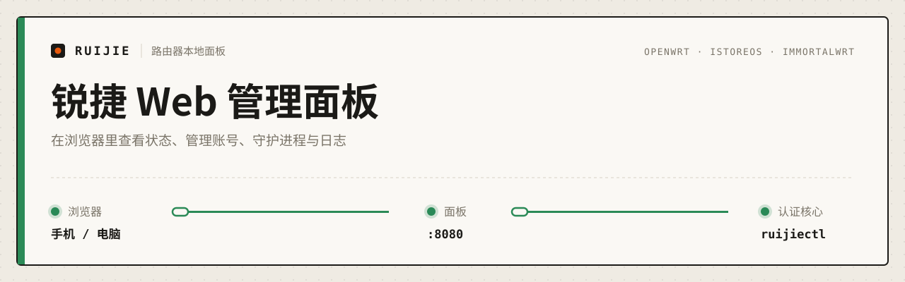

<p align="center">
  
</p>

<p align="center">
  <a href="https://github.com/huantuoshen-prog/ruijie-web-panel/actions"></a>
  <a href="https://github.com/huantuoshen-prog/ruijie-web-panel/releases"></a>
  
  
</p>

<p align="center">
  <b>01</b> <a href="#快速开始">快速开始</a> ·
  <b>02</b> <a href="#界面">界面</a> ·
  <b>03</b> <a href="#文档">文档</a> ·
  <b>04</b> <a href="#相关项目">相关项目</a>
</p>

---

运行在 OpenWrt / iStoreOS / ImmortalWrt 路由器上的本地网页面板，面向广东科学技术职业学院（广科院、GDSTVC）校园网用户。手机或电脑打开路由器地址，就能看联网状态、改账号、控制守护进程、翻日志。

> [!IMPORTANT]
> 面板依赖认证核心 [ruijie-gdstvc-autologin](https://github.com/huantuoshen-prog/ruijie-gdstvc-autologin)。请先装好核心，或直接使用下面的组合包。

```text
 browser ─────▶ panel :8080 ─────▶ core
                uhttpd + CGI       /etc/ruijie/ruijiectl
```

## 快速开始

<sub><code>01</code></sub>

在路由器终端下载固定版本的组合包并校验：

```sh
cd /tmp
curl -fLO https://github.com/huantuoshen-prog/ruijie-web-panel/releases/download/v4.0.0/ruijie-openwrt-bundle.tar.gz
curl -fLO https://github.com/huantuoshen-prog/ruijie-web-panel/releases/download/v4.0.0/SHA256SUMS
grep ' ruijie-openwrt-bundle.tar.gz$' SHA256SUMS | sha256sum -c -
```

解压和安装命令见 [安装文档](./docs/install.md)。请不要逐个下载 `main` 分支的文件。

装好之后：

| 步骤 | 做什么 |
|:---:|---|
| `1` | 记下安装时设置的面板密码 |
| `2` | 浏览器打开 `http://192.168.5.1:8080/` 或 `http://192.168.1.1:8080/` |
| `3` | 登录。同一浏览器会保持登录 30 天，访问时自动续期 |

## 界面

<sub><code>02</code></sub>

顶部四个标签页，首屏就是答案：现在有没有网。

| 标签页 | 内容 |
|---|---|
| **状态** | 联网状态、连接链路图、重新认证 / 下线、守护进程启停、健康监听开关、最近事件 |
| **账号** | 用户名、密码、运营商（电信 / 联通），HTTP / HTTPS 代理 |
| **日志** | 认证日志与健康日志，按级别、类型、条数筛选，自动刷新 |
| **系统** | 运行环境、关键文件路径、浅色 / 深色主题、退出 |

连接链路图的读法（`━` 实线表示这一段通，`┅` 虚线表示断开或未知）：

| 链路 | 说明 |
|---|---|
| `● daemon ━━━ ● auth ━━━ ● internet` | 全部在线 |
| `● daemon ━━━ ● auth ┅┅┅ ○ internet` | 认证后仍无法联网 |
| `○ daemon ┅┅┅ ○ auth ┅┅┅ ○ internet` | 守护进程未运行 |

- 健康监听需要核心 4.0.0 及以上。核心首次安装后默认开启 3 天，升级不会自动重开。
- 想让 Agent 帮忙分析当前状态，可以用核心仓库的 [调试 Prompt](https://github.com/huantuoshen-prog/ruijie-gdstvc-autologin/blob/main/docs/AGENT_DEBUG_PROMPT.md)。

## 文档

<sub><code>03</code></sub>

| 文档 | 内容 |
|---|---|
| [安装](./docs/install.md) | 系统要求、组合包、升级、回滚、卸载 |
| [使用](./docs/usage.md) | 各标签页功能、健康监听、主题 |
| [API](./docs/api.md) | `/ruijie-cgi/*` 路由、鉴权、请求与响应示例 |
| [故障排除](./docs/troubleshooting.md) | 装不上、打不开、认证失败、安全注意事项 |
| [开发](./docs/development.md) | 项目结构、本地 mock、前端测试 |
| [Agent 安装 Prompt](./docs/AGENT_INSTALL_PROMPT.md) | 交给 Agent 代为安装 |
| [更新记录](./CHANGELOG.md) | 版本历史 |

技术栈：React + Vite + TypeScript 前端，Shell CGI 后端，独立面板密码与会话保护。

## 相关项目

<sub><code>04</code></sub>

| 项目 | 说明 |
|---|---|
| [**ruijie-gdstvc-autologin**](https://github.com/huantuoshen-prog/ruijie-gdstvc-autologin) | 认证核心：自动登录、断线重连、健康监听、JSON CLI |
| [Qclaw](https://github.com/qiuzhi2046/Qclaw) | OpenClaw 桌面管家（非本项目） |

---

<sub>
反馈安装体验、固件兼容性或文档问题，欢迎提 issue。提交前请删掉账号、密码、MAC 地址、内网 IP、会话令牌和完整认证链接。<br>
本项目不是学校官方软件。MIT 许可证，见 <a href="./LICENSE">LICENSE</a>。<br>
关键词：OpenWrt 锐捷认证 · 校园网自动登录 · 广东科学技术职业学院 · 广科院 · GDSTVC · iStoreOS · ImmortalWrt · 路由器 Web 面板
</sub>
